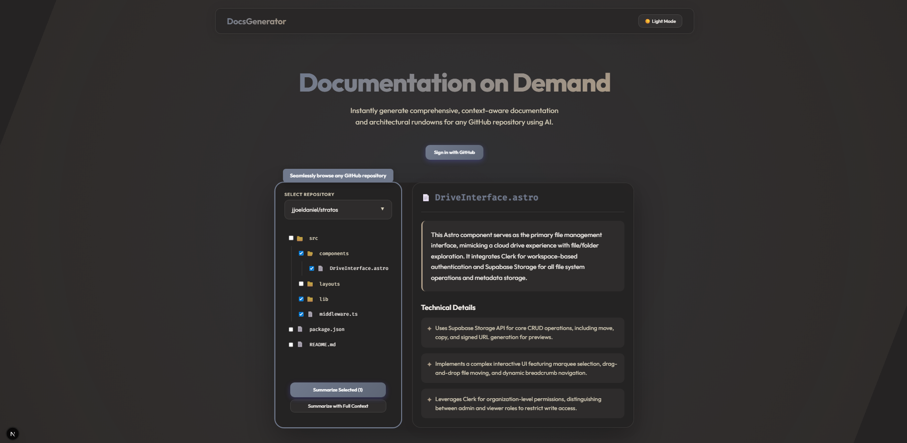
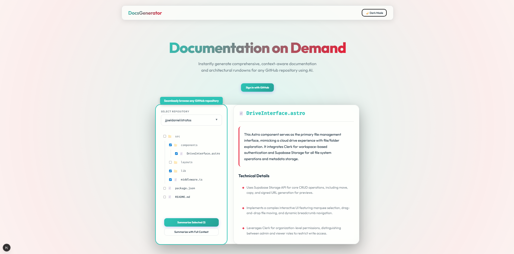
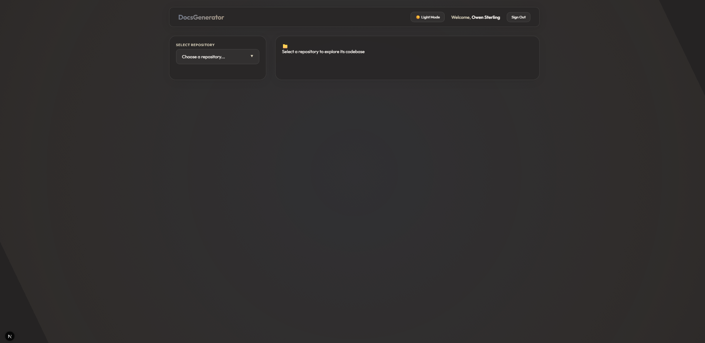
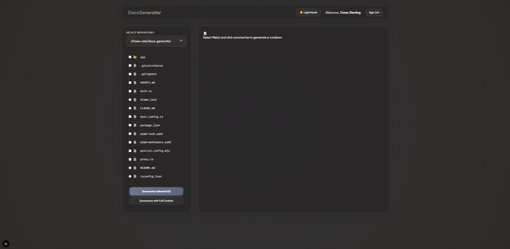
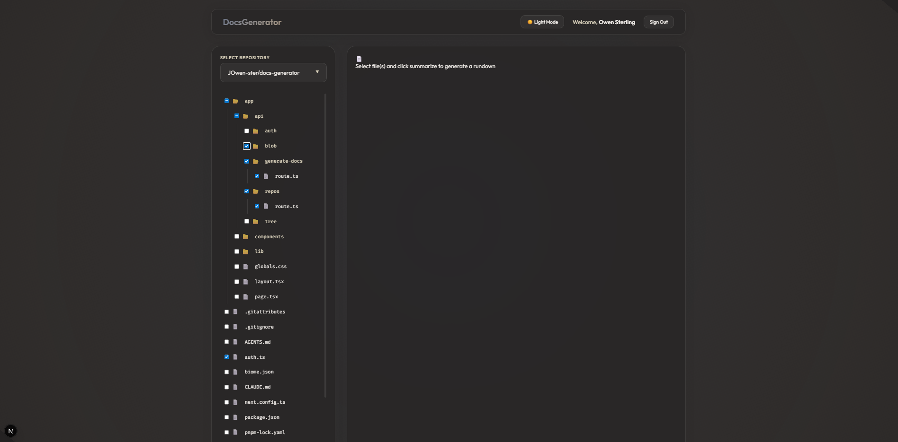
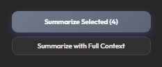
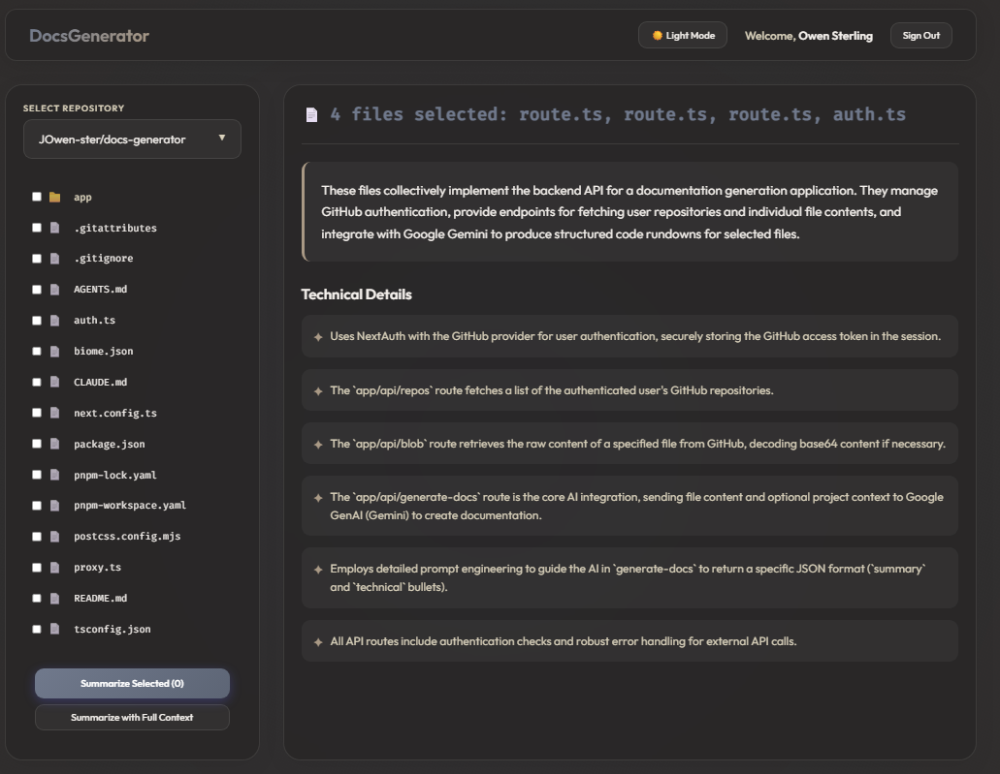

# 📝 DocsGenerator

**Instantly generate comprehensive, context-aware documentation and architectural rundowns for any GitHub repository using AI.**

DocsGenerator simplifies the process of understanding complex codebases by leveraging Google Gemini to provide technical summaries of files and directories directly within your browser.

---

## ✨ Key Features

- **🔐 Secure Authentication**: Sign in with GitHub to access your public and private repositories.
- **🌳 Recursive File Tree**: Explore repositories with a native-feeling tree view.
- **🤖 AI-Powered Rundowns**: Generate 2-3 sentence summaries and key technical bullets for any file or directory.
- **⚡ High Performance**: Built with Next.js 15/16 and the React Compiler for a snappy user experience.
- **🌗 Theme Support**: Fully functional light and dark modes.

---

## 🖼️ Preview

### 🌗 Dark & Light Mode



<br>



---

### 🛠️ Workflow & Features



<br>



<br>



---

### 💻 Generation Options



<br>



---

## 🚀 Getting Started

### 1. Obtain API Keys

You will need the following credentials to run the application:

| Key | Description | Source |
| :--- | :--- | :--- |
| `GEMINI_API_KEY` | Google AI Studio Key | [Google AI Studio](https://aistudio.google.com/app/apikey) |
| `AUTH_GITHUB_ID` | GitHub OAuth Client ID | [GitHub Developer Settings](https://github.com/settings/developers) |
| `AUTH_GITHUB_SECRET` | GitHub OAuth Client Secret | [GitHub Developer Settings](https://github.com/settings/developers) |
| `AUTH_SECRET` | NextAuth Encryption Secret | Run `pnpm dlx auth secret` |

> **Note**: When creating your GitHub OAuth App, set the **Authorization callback URL** to `http://localhost:3000/api/auth/callback/github`.

### 2. Configure Environment

Create a `.env.local` file in the root directory and add your keys:

```bash
GEMINI_API_KEY=your_gemini_key
AUTH_GITHUB_ID=your_github_id
AUTH_GITHUB_SECRET=your_github_secret
AUTH_SECRET=your_auth_secret
```

### 3. Install & Run

Install project dependencies.

```bash
pnpm i
```

### Start the development server

```bash
pnpm run dev
```

Open [http://localhost:3000](http://localhost:3000) to see the result.

---

## 📂 Directory Structure

| Path | Description |
| :--- | :--- |
| **`app/`** | The main application logic using Next.js App Router. |
| **`app/api/`** | Serverless functions for Auth, GitHub API proxying, and Gemini generation. |
| **`app/components/`** | React components (`AppShell`, `FileTree`, `FileRundown`, etc.). |
| **`app/lib/github/`** | Core utilities for fetching repository trees and blob contents. |
| **`auth.ts`** | NextAuth configuration and GitHub provider setup. |
| **`public/`** | Static assets like icons and images. |
| **`biome.json`** | Configuration for the Biome linter and formatter. |

---

## 🛠️ Development

- **Linting**: `pnpm run lint` (uses Biome)
- **Formatting**: `pnpm run format`
- **Build**: `pnpm run build`
- **Start a Build**: `pnpm run start`

---
